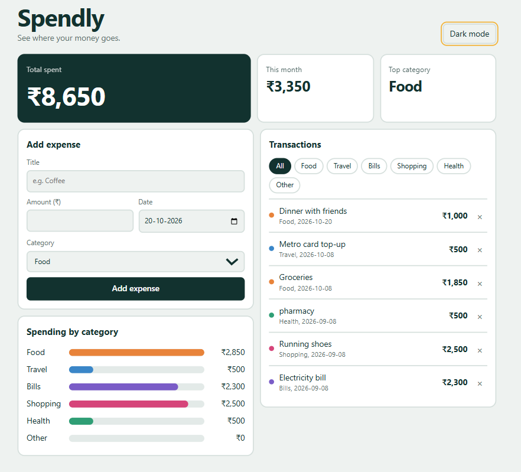
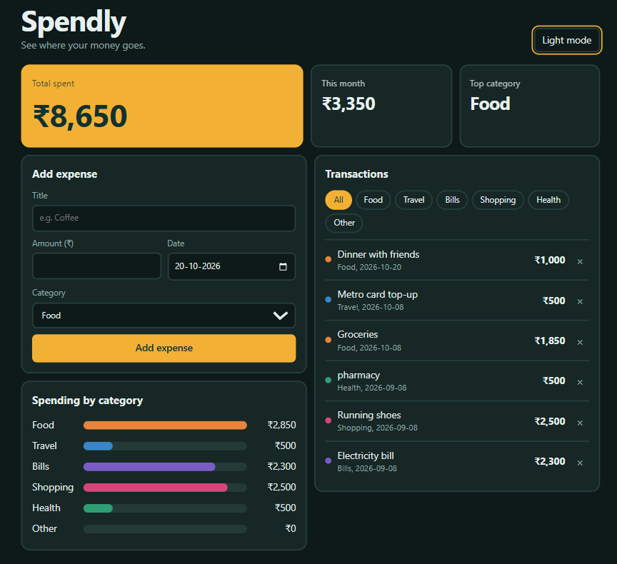

# Spendly: Expense Tracker

A responsive expense tracker that shows where your money goes.
Add expenses, filter by category and see your spending at a glance.

**Live demo:** https://spendly-expense-tracker-rust.vercel.app



## Features

- Add expenses with title, amount, date and category, with input validation
- Delete expenses
- Summary cards: total spent, this month's spending and top category
- Bar chart of spending by category (click a bar to filter)
- Category filter chips on the transactions list
- Data saved in the browser with localStorage, so it survives a refresh
- Light and dark mode, remembering your choice
- Responsive layout for desktop and mobile
- Keyboard accessible, with visible focus and labels for screen readers

## Tech stack

- React (hooks: useState, useEffect, useMemo)
- JavaScript (ES6+)
- Vite
- CSS (Grid, Flexbox, CSS variables, media queries)
- ESLint
- Git and GitHub, deployed on Vercel

## Screenshots

| Light mode | Dark mode |
|---|---|
|  |  |

## Project structure

```
src/
  components/
    AddForm.jsx   form with validation
    Chart.jsx     category bars and filtering
    List.jsx      transactions list with filter chips
    Stats.jsx     summary cards
  constants.js    categories, colors and helper functions
  App.jsx         app state and layout
  main.jsx        entry point
  index.css       styles and theme variables
```

## Run locally

```bash
git clone https://github.com/deepankumar0710/spendly-expense-tracker.git
cd spendly-expense-tracker
npm install
npm run dev
```

Then open the link shown in the terminal (usually http://localhost:5173).

## What I learned

- Splitting a UI into reusable components and passing data with props
- Lifting state up so sibling components share the same data
- Controlled form inputs and validation
- Deriving values (totals, top category) instead of storing them
- Saving data with localStorage and useEffect
- Theming with CSS variables and building a responsive layout

## Future improvements

- Edit existing expenses
- Monthly budget with warnings
- Python (Flask) backend with a database
- Export to CSV

## Author

Deepan kumar | deepanmessi0710@gmail.com